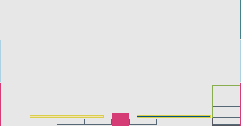

**D3sktop-3, a computer system for intuitive interaction between processes**

(N.B: I don't know if it's possible to make an industrial patent out of something like this; it turned out some patents do surprisingly exist because they have an real world impact, or real world resonance e.g. 1-Click from _Amazon_, so I don't know what qualifies for something like that. I don't want the idea to be stolen and so the __specification__ is **ALREADY** registered in the _electronic Copyright EU_  via blockchain Timestamp, and also in the _US Copyright Office_ via an opened case)


Having said that... moving on!!!

## Specification.
The system acts like an app, software or software services launcher; and distribute what is in execution (once launched) over two antagonistic points.

Each application or service that is launched is executed in one of each antagonistic in an alternating fashion, unless is marked as determined for one of the two beforehand. By being assigned to on side, each is recognized thru a pattern or priority based on hierarchy of patterns. Even can be pre-assigned to specific spaced inside each _side_, or _slot_.

Each _endpoint_, in this system **is** synonym of _side_ (right, left), _monitor, display_ (right, left), _point_ (1 current; 2 target, selected antagonist).

At a given moment one program or service is selected as _active_ and also, is active at a given moment _one or zero for each side_, so you can do contextual operations that are required to the _current_ process and are executed towards the process _of the other endpoint_. The selected process on the other side is just the former.

The representation of this is a computational display environment with traditional windows in which there is an internal communications protocol that identifies each process and its capability, as well as the opposing (or previous) process and its capability. There is a _handshaking_ or response to the request that indicates whether it is compatible and the result of the operation with the source data.

Thus, a protocol message contains an application _UUID_, which negotiates capabilities and operation compatibility; an _operation_, which defines it; and some _data_, which can be a list (of one or more), the contents of the standard _clipboard_ of the system on which it is used, or abstract data (_BLOB_) with a structure that the recipient understands according to the compatibility table, _or even a hierarchy_.
_hierarchy_: For example, the receiver cannot process a _.sql_ file with inserts but can use it as plain text

### Foundations on which this system improves effectiveness in prolonged human interactions.

Most operations are performed on two operands. This is true in assembly and traditional computational theory, where an _accumulator_ is often used. The idea is to overview this _accumulator_, as a process, the one intuitively used just before during interaction with the computer; or it can also be seen as the second operand.

Most of the operations we perform on a computer are performed in pairs. In human-computer interaction, pairwise comparisons reduce long-term stress and also naturally serve as a means of corroboration (see _diff_ tools, version controls, etc.), which further reduces stress.

In this system, there is a natural process of _stacking (push)_ and _unstacking (pop)_ for each _side_ or _endpoint_, so that the mind works like a stack of functions, in which you complete the work by releasing each one from the top; or, in this case, from each position (or _slot_) already learned through repeated use.

In this sense (the previous one), it can be said that _all possible tasks can be performed in pairs_, alternating between sets of pairs.

If there are **really** two sides, why not use them thoughtfully?

Let's see a real example in assembler _(https://github.com/octobanana/hexana/blob/master/src/main.asm#L280 under MIT License Copyright (c) 2019 Brett Robinson)_, it is very natural to see it working on operations between applications —the most common use in everyday office.

```
  ; copy the template line into the format buffer
  mov rdx, line_len
  mov rsi, line
  mov rdi, buf_fmt
  call memcpy

; write the offset count to the format buffer
offset:
  ; store pointer to the start of the format/offset buffer
  lea rbp, [buf_fmt + begin_offset]
  ; the index used to write into the buffer
  mov rbx, 7h
  ; the index used to shift the number by 4 each loop
  xor rcx, rcx
```

On the other hand, __we love multitasking__:
We naturally combine _levels of abstraction_ and _concentration_ during long workdays. We place tasks with **different** levels of _attention_, _validation_, _service_, and _enjoyment_ on one side, and **differentiate** them from the other. At the same time, we promote integration between these two levels. We always do this, but here we have the advantage of utilizing both sides differently.

### Details and material aspects as a sample of implementation


1. The figure shows the environment startup, with nothing launched. As we can see, it's quite clear. The much-desired symmetry is achieved, as good for both _state of expectation_ and _marketing_; and the upper part is also completely freed, _representing a natural horizon_. These are some kind of advantages. The two side squares at the bottom mark a special _slot_ and can be a bit clogging, so their appearance can also be postponed until an application is using them. The two lower bars are indicators, that you can swipe in from outside or _left-click_ on them. The middle button is the menu and/or launcher. The two horizontal bars are the pointers for the current _side_, _display_, or _point_. In addition, **there should be a small indicator of the current application on each side**, which doesn't appear in the diagram for simplicity.


The system **respects all key configurations** and only adds some navigation keys using the _Super_ key, sometimes also called _Meta_.

The first side selected by default can be the left or _the first depending on the typing direction_.

A display can have both sides assigned, in which case it is a _single-monitor_ configuration; or only one, in which case it is a _dual-monitor_ configuration. Only the assigned sides appear on each monitor in the horizontal indicators. If there are two monitors, the other _side_ does not appear, but an arrow pointing to the physical location of the other side may appear. This is configurable. **There is no** other type of configuration with more monitors in this system, since the complexity of such an approach would overwhelm all the advantages of being so intuitive.

The bars at the bottom and sides are visible but minimal so as not to hinder the traditional windows and their functionality.


2. First launched application, with the corresponding _side_ newly selected. This is because there is no predefined zone or _slot_ for that application or service, or a _running application pattern detected_; either it corresponds to that side or that specific slot. In any case, the system starts with those closest to the home button since it is the most intuitive.

From a traditional perspective, **the applications behave completely normally**; the only thing is that in each run, one is marked as active on each side, or on a monitor (defined as one side).

The main thing is that **they can be freely moved from side to side or slot, etc.** This is very good for integration.

A program can be pinned to a slot, and then it will only occupy the free space. This way, a user can already have in mind the process areas _background: music, etc._, _services_, _remote connections_, _emails and data entries..._ in a customized way, and __now it can be intuitive from one session to the next__. **There is the option to save each session configuration** so that everything appears exactly as wanted. In each recording, you can ask about the changes since the previous recording and whether you are happy with them or not; although it is not saved by default to increase capacity and freedom of movement in front of the computer without fear of losing what you have set as pinned.


	Trivial Pursuit for  Commodore-64, image captured by _mobygame_

This further opens the experience to a customizable desktop, with photos and diagrams in the central menu, which we'll discuss as an extension of the idea. Similarly, and following the same logic of natural spatial separation developed here, we can think of the central menu and recall a __certain historical degree of skeuomorphism__.



3. Several applications or processes are running and side 2 is selected. The _stack_ on side 2 is also open. There is another stack on the other side, containing _slots_ to be filled when the others are used or when processes have been predestined there. Each slot in the stack has a number; 0 is the first or used slot, and the rest up are from 1 to n. The currently used slot is also visible on the stack (duplicated) for easy visual location.
4. In addition to the _lower side areas_ that can be moved with your finger or the primary mouse button, which are used to display the _stacks_, the image also shows the _intermediate side areas_ or areas for changing _sides_ or monitors, etc., which are **not visible** to improve ergonomics and are used with touch scrolling. There is a very convenient keyboard shortcut for this, `Super + Tab`, so no further mode of operation is needed here. As an extra feature, you can scroll _further toward the already selected side_, but taking the scrolling to a position deep within the screen... and the system configuration menu or screen would then exist there _or any other convenient screen_, but the movement for this must be greater than simply changing sides.
5. At the top of the selected _side_ is an area _whose scrolling or secondary click_ activates the current application's sending or interaction context. The opposite position of the screen is **left unused** to avoid overloading the functionality and to make it as intuitive as possible.

Pressing on the secondary action or long-pressing the touchscreen on each app running in a _slot_ shows whether it is pinned to the _slot_ and whether it is pre-docked to a _side_. After this, a menu is displayed to do so, whether docking to a _slot_ or a _side_, or even assigning a number to the stack **position**, which will be remembered for the duration of the session; or if saved, for subsequent sessions.

`Super + Tab`: Switches the side
`Super + Enter`: Changes the current slot to the selected slot (0) on the current side of the stack. Remember that changing the current _slot_ changes the process on the screen. This is why it's necessary to mark (within a box) the selected slot on the stack to facilitate the equivalence with this keyboard shortcut...
`Super + 0`: Same as `Super + Enter` above. The numbers on the keyboard and calculator zone should work _always_, regardless of the current `Num Lock` option.
`Super + n`: Changes the selected item in the stack to 0, after which it selects 0.
`Super + Up, Down`: Same as above, but the selection is not made until the `Super` is released.
`Super + Left, Right`: Moves through the sockets in that direction and selects them.
`Super + Shift + []`: Pressing `Shift` does not select the socket, but rather **moves** the current one and _works for all of the above_.
There is also a button to _swap_ filling half of the screen with each selected process, or the full screen, in the case of a single-monitor setup.

### Appendix: Additional Ideas for the central menu and other considerations and achievements

#### The original D3stop-3 concept!!

**D3sktop-3** because it's the third iteration in the desktop world. Also because there are three distinct regions: center and sides.
##### The internal menu


The activity launcher is a piece to be placed within the menu. Activities can be entire saved environments, as we've seen.

The menu screen has the following sizes and components:

* **3x2**: (which allows an icon and full text, better than the normally used _2x2_, _4x4_, …).
* **2x2**: An icon.
* **Large sizes like 3x4 with vertical info**: weather, etc.
* **Customizable** decorative photos, better **from 3x3** and bigger: family photos, small tracking diagrams, small vision boards (it's your desktop!)

	What matters is the icon and text, not the border of the tile, which is hidden by the background.

The menu can have multiple tabs, listed side by side in the bottom, with panels that include the above elements **and JSON-based Canvas specific panels** (https://jsoncanvas.org/ _JSON Canvas is open source under the MIT license_).

Small elements: No tapping on small elements: minimized application icons, the time, calendar, etc. are accessed through the menu. Even notifications should appear within the menu.
#### Design Advantages and Achievements:

- Stable pinned elements. The menu is always in the same position.

- There's no need for icons without text, since this is not good practice.

- It's completely symmetrical. Total symmetry. Peace (and a long-awaited marketing milestone).

- It leverages one-handed task management.

- It plays with spatial relevance to ease eye searching.

- The wide buttons are suitable for touchscreens.

- The borders are also suitable for touchscreens; you get good use of your monitor's edges and swipe gestures without overloading or overcomplicating it.

- Easy access to scenarios: The activity history is intrinsically retrieved for what is considered relevant.
